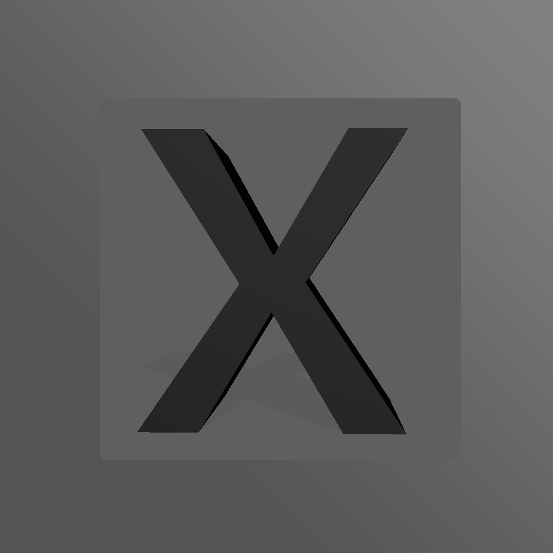

## Hi there 👋

<h2 align="center"> Hi, I'm aacc577 👋   </h2> 

  <!-- dynamic typing effect 动态打字效果 -->
  

    
  

## 目前会的代码
<samp>目前还在学习以后会更多</samp>

<table>
<tbody>
 <tr>
<td align="center" width="20%">
<b style="text-align: center;">Python</b> 
 
</td>

<td align="center" width="20%">
<b style="text-align: center;">HTML</b> 
 
</td>

<td align="center" width="20%">
<b style="text-align: center;">C++</b> 
 
</td>
</tr>

<tr>
<td align="center" width="20%">
<b style="text-align: center;">Git</b> 
 
</td>

<td align="center" width="20%">
<b style="text-align: center;">JavaScript</b> 
 
</td>

<td align="center" width="20%">
<b style="text-align: center;">Java</b> 
 
</td>
</tr>

<samp>目前个人主页访问量</samp> 

</tbody>
</table>
<!--
**aacc577/aacc577** is a ✨ _special_ ✨ repository because its `README.md` (this file) appears on your GitHub profile.

Here are some ideas to get you started:

- 🔭 I’m currently working on ...
- 🌱 I’m currently learning ...
- 👯 I’m looking to collaborate on ...
- 🤔 I’m looking for help with ...
- 💬 Ask me about ...
- 📫 How to reach me: ...
- 😄 Pronouns: ...
- ⚡ Fun fact: ...
-->
